<!--
  Omar Tood — AI Research Portfolio README
  Animated assets live in /svg and are generated by assets/scripts/generate_svgs.py
  (pure SVG + CSS, no JavaScript, GitHub-safe). Re-run the generator to re-tune.
-->

 

 

## ◇ About

I'm **Omar Tood** — an AI Researcher and Software Engineer with an **MSc in Artificial Intelligence**. I build intelligent systems around **Large Language Models**, **agentic AI**, and **transformer architectures**, with a focus on bringing modern NLP to **low-resource languages like Somali**.

 

## ◇ Tech Stack

&nbsp;

&nbsp;

 

## ◇ Featured Projects

<table>
<tr>
<td valign="top" width="50%">

### 🧠 Somali LLM
A large language model built for the **Somali language** — tokenizer, pretraining, and fine-tuning for quality generation in an underserved language.

</td>
<td valign="top" width="50%">

### 🤖 AI Learning Companion
An agentic tutor for AI & data science — retrieval-grounded answers and step-by-step reasoning powered by LLMs.

</td>
</tr>
<tr>
<td valign="top" width="50%">

### ⚖️ Dastuur AI
A legal-reasoning assistant over constitutional text — retrieval-augmented, citation-aware answers grounded in sources.

</td>
<td valign="top" width="50%">

### 📊 Somali AI Benchmark
An evaluation suite measuring how well models understand and generate Somali — standardized tasks and metrics.

</td>
</tr>
</table>

<a href="https://github.com/omartood?tab=repositories">Explore all repositories →</a>

 

## ◇ Self-Attention, in Somali

Self-attention visualized over a Somali sentence — the kind of low-resource NLP I work on. Each query token lights up and weighs the rest of the sequence.

 

## ◇ GitHub Stats

 

 

