<!--
  Omar Tood — AI Research Portfolio README
  Animated assets live in /svg and are generated by assets/scripts/generate_svgs.py
  (pure SVG + CSS, no JavaScript, GitHub-safe). Re-run the generator to re-tune.
-->

 

 

## ◇ About Me

I'm **Omar Tood** — an AI Researcher and Software Engineer with an **MSc in Artificial Intelligence**. I design and build intelligent systems around **Large Language Models**, **agentic AI**, and **transformer architectures**, with a particular focus on bringing modern NLP to **low-resource languages like Somali**.

My work sits at the intersection of research and engineering: reading papers, training and evaluating models, and shipping the infrastructure that turns them into products. I care about systems that *reason*, not just autocomplete — and about making cutting-edge AI accessible beyond English.

 

### ◇ The way I think about AI systems

 

## ◇ Current Focus &nbsp;·&nbsp; Research Interests

<table>
<tr>
<td valign="top" width="50%">

**🎯 Current Focus**

- Large Language Models
- Agentic AI
- Transformer Research
- Somali NLP
- Open Source AI
- AI Research

</td>
<td valign="top" width="50%">

**🔬 Research Interests**

- Natural Language Processing
- Deep Learning
- Multi-Agent Systems
- Retrieval-Augmented Generation
- Reasoning Models
- Efficient LLMs

</td>
</tr>
</table>

 

## ◇ Tech Stack

**Languages**

**AI / ML**

**Backend**

**Frontend**

**Database**

**Tools**

 

## ◇ Featured Projects

<table>
<tr>
<td valign="top" width="50%">

### 🧠 Somali LLM
A large language model built for the **Somali language** — tokenizer, pretraining data, and fine-tuning aimed at high-quality generation and reasoning in an underserved language.

`LLM` · `PyTorch` · `Transformers`

</td>
<td valign="top" width="50%">

### 🤖 AI Learning Companion
An agentic tutor that teaches AI & data science — retrieval-grounded answers, step-by-step reasoning, and adaptive lessons powered by LLMs.

`Agents` · `RAG` · `LangGraph`

</td>
</tr>
<tr>
<td valign="top" width="50%">

### ⚖️ Dastuur AI
A legal-reasoning assistant over constitutional and legal text — retrieval-augmented, citation-aware answers grounded in source documents.

`RAG` · `LLM` · `FastAPI`

</td>
<td valign="top" width="50%">

### 📊 Somali AI Benchmark
An evaluation suite measuring how well models understand and generate Somali — standardized tasks, metrics, and leaderboards for Somali NLP.

`Evaluation` · `NLP` · `Benchmarks`

</td>
</tr>
</table>

<a href="https://github.com/omartood?tab=repositories">Explore all repositories →</a>

 

## ◇ Self-Attention, in Somali

Every token attends to every other — here's self-attention visualized over a Somali sentence, the kind of low-resource NLP I work on. Watch each query token light up and weigh the rest of the sequence.

 

## ◇ GitHub Stats

 

 
 

 

<!-- Contribution snake — generated by .github/workflows/snake.yml into the `output` branch -->

 

 

 

